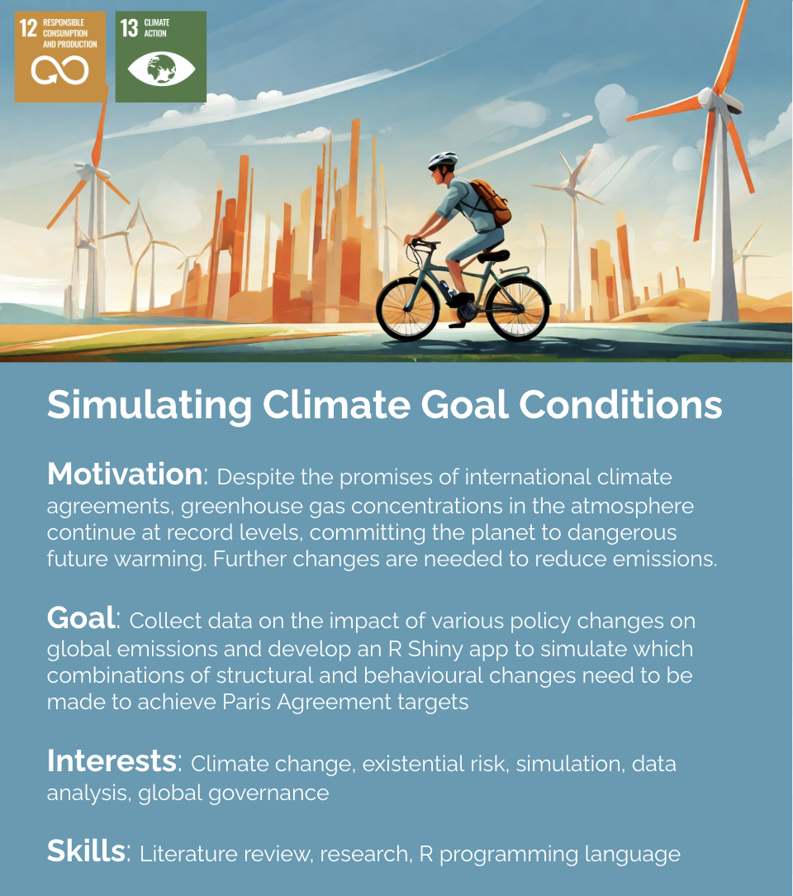

# Simulating Climate Goal Conditions

Despite the promises of international climate agreements, greenhouse gas concentrations in the atmosphere continue at record levels, committing the planet to dangerous future warming. Further changes are needed to reduce emissions. For this project, we will collect data on the impact of various policy changes on global emissions and develop an R Shiny app to simulate which combinations of structural and behavioural changes need to be made to achieve Paris Agreement targets

### Team Meetings:
[When2Meet](https://www.when2meet.com/?24215131-k65UD)

### Useful Links:

[Climate change mitigation: reducing emissions](https://www.eea.europa.eu/en/topics/in-depth/climate-change-mitigation-reducing-emissions#:~:text=Now%2C%20more%20ambitious%20goals%20are,fuels%20to%20clean%2C%20renewable%20energy.)

[Sources of Greenhouse Gas Emissions | US EPA](https://www.epa.gov/ghgemissions/sources-greenhouse-gas-emissions#:~:text=Human%20activities%20are%20responsible%20for,over%20the%20last%20150%20years.&text=The%20largest%20source%20of%20greenhouse,electricity%2C%20heat%2C%20and%20transportation.)

[Emissions by sector: where do greenhouse gases come from? - Our World in Data](https://ourworldindata.org/emissions-by-sector)
